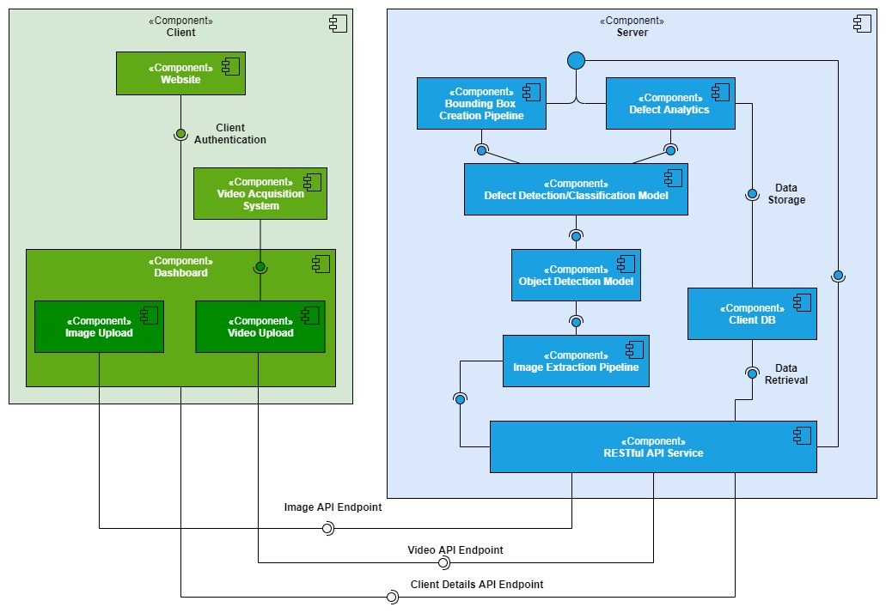

# McDefect Solutions 

**_"Supporting You, Defect by Defect"_**

## Business Problem

- India ranks 3rd in global manufacturing locations in the world and production of the basic metal is the highest contributor in the GDP of the manufacturing industry, (i.e. about 11%). In 2016, PM Narendra Modi started an initiative __"​Zero defect zero effect​"__ aimed at reducing the defects in manufacturing as well as ecological effects. Even though the initiative saw a good start, it hasn't achieved enough success as the
decrease in defects dropped after a couple of years.

- The major reason for this was no new technological change in identifying defects in the early stage of the manufacturing i.e., the raw material production stage (billets, pipes, sheets, slabs, etc.).

- To reduce wastage and save time and manual effort, we need to automate defect detection and integrate with existing processes and facilities. Customers also need the technique to detect defects with high accuracy.

## Solution

- Create __AI-powered defect detection & classification solutions__ for industries that cater to the initial stages of manufacturing, using transfer learning by training it for different processes (like casting, rolling, etc.), gaining knowledge from one, and applying it to other processes.

- This will automate the detection, improve the efficiency of the production, and most importantly, it will provide a boost to the manufacturing industry economically.

## Business Case

- **Strategic context:** Tapping the defect detection in early stages of manufacturing processes (like casting, rolling, etc.) using Convolutional Neural Network to save time and efforts, improve process efficiency and reduce wastage (thus, reducing costs) for customers.

- **Economic analysis:** Return on the usage of services provided on API to the manufacturing company

- **Commercial approach:** Datasets are collected from the specified company for the process and then the model is trained on it.

- **Financial case:** Since it is a technological solution, no large investments are required. Initial datasets to train models are available for free. Thus, affordability is not an issue here.

- **Management approach:** For roles and responsibilities, refer to RASIC + GANTT chart. New developments/updates in API will be made in later stages to improve the products from customer perspective + services and attract more customers.

- **Risk analysis:** The following are some key risks
    -  Initial trust by the manufacturing industry on technological solutions.
    -  Dataset compatibility with the model and/or API integration with the existing structure of the company might fail.

## Requirements

- `keras`
- `opencv`
- `sklearn`
- `numpy`
- `matplotlib`
- `fastapi`
- `HTML/CSS/JavaScript`

## Data

We use the following datasets for training our models:

- [Submersible Pump Impeller Defect Dataset](https://www.kaggle.com/ravirajsinh45/real-life-industrial-dataset-of-casting-product) _(For defect detection)_
- [Metal Surface Defect Dataset](https://www.kaggle.com/fantacher/neu-metal-surface-defects-data) _(For defect classification)_

## Models

Three Deep Neural Models that have been developed as a part of this project, for the following tasks:

- __Custom Object (Pump Impeller) Detection__ _(Fine-tuning of RetinaNet Architecture using ResNet50 Backbone)_
- __Defect Detection from images of Pump Impellers__ _(Transfer Learning using VGG16 Architecture)_
- __Defect Classification for Metal Surfaces__ _(Transfer Learning using VGG16 Architecture)_

Details about the models, inculding their training, performance & downloadable weights can be found [here](./models/README.md).

## Deployment
The overall system architecture of McDefect Solutions is presented below:

We use __FastAPI__ for building the RESTful API server for deploying the models. The code, along with the steps to set up the server can be found [here](./server/README.md)

The website & demo portal for uploading images (& videos) for defect detection or classification is built using __HTML__, __CSS__ & __JavaScript__. The code & relevant information about McDefect Solutions can be found [here](./client/README.md). 

## Reports

- [Proposal](./reports/1_ProjectProposal.pdf)
- [Project Planning](./reports/2_ProjectPlanning.pdf)
- [Conceptual Design](./reports/3_ConceptualDesignReport.pdf)
- Model Training & Testing Report (to be added)
- Unit Testing Report (to be added)

## Marketing & Demonstration

- [Product Brochure](./brochure.pdf)
- [Marketing Video](./client/assets/marketing_video.mp4)
- User Manual (to be added)

<!-- ## Future Direction

[TODO] -->
