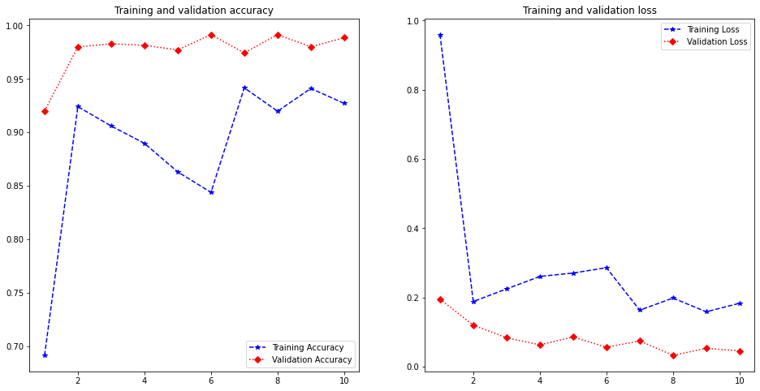
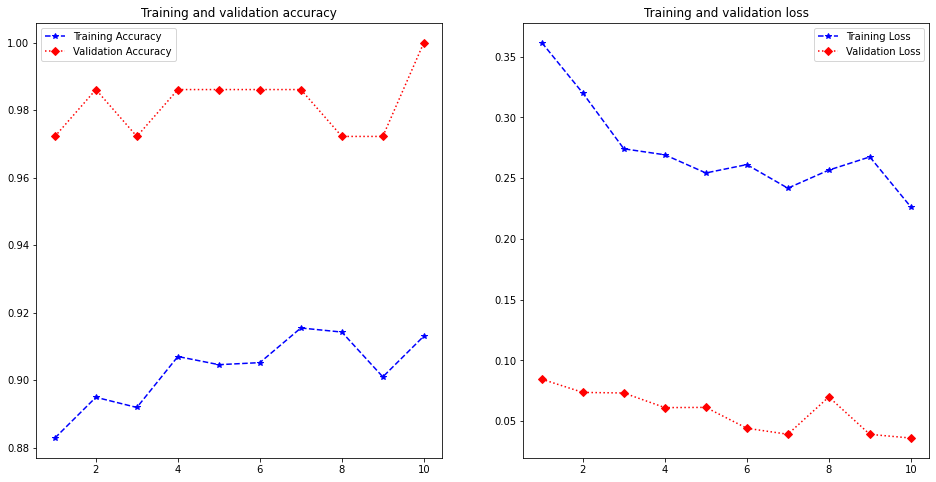

# Deep Learning Models

Following are the weights for the Deep Neural Models that have been developed as a part of this project:

- __Object Detection:__ [`pump_impeller_detection_retinanet.h5`](https://drive.google.com/file/d/1QGebcE24wIKiALsztVm0wLPkMKBS4LSI/view?usp=sharing)
- __Defect Detection:__ [`defect_detection_vgg16.hdf5`](https://drive.google.com/file/d/11o3l6DGXZf0Et1nvkaf0aSQHdGXsi8BU/view?usp=sharing)
- __Defect Classification:__ [`defect_classification_vgg16.hdf5`](https://drive.google.com/file/d/1OdA9lB7lfvWxQZKCLMNvEmmXWchUbhuj/view?usp=sharing)

## Object Detection Model

The object detection model (for our demo) uses the RetinaNet architecture (with ResNet50 backbone) & is fine-tuned to detect & segement _Pump Impellers_ within images so that these identified impellers can be run through our defect detection model to identify whether an impeller is defective or not.

The entire training can be found in [this notebook](./ObjectDetectionRetinanet.ipynb).

This model can downloaded & used as follows:

```python
from keras_retinanet import models

MODEL_FILE = "pump_impeller_detection_retinanet.h5" 

model = models.load_model(model_path, backbone_name='resnet50')
```

_**Note:** To use `keras_retinanet`, the [corresponding repository](https://github.com/fizyr/keras-retinanet) must be downloaded & set up. The setup steps can also be found in the [training notebook](./ObjectDetectionRetinanet.ipynb)._


## Defect Detection & Classification Models

The Defect Detection & Defect Classification Models (for our demo) have been trained using Transfer Learning, with VGG16 as the base model.

The __Defect Detection__ model has been trained on the [Submersible Pump Impeller Defect Dataset](https://www.kaggle.com/ravirajsinh45/real-life-industrial-dataset-of-casting-product). The entire training can be found in [this notebook](./DefectDetectionVGG.ipynb). We achieve a test accuracy of _98.88 %_. The plot for the performance of the model over training period is presented below:



The __Defect Classification__ model has been trained on the [Metal Surface Defect Dataset](https://www.kaggle.com/fantacher/neu-metal-surface-defects-data). The entire training can be found in [this notebook](./DefectClassificationVGG.ipynb). We achieve a training accuracy of _91.3 %_ and a test accuracy of _100 %_. The plot for the performance of the model over training period is presented below:



These models can be downloaded and used as follows:

```python
from keras.models import load_model 

MODEL_FILE = "defect_detection_vgg16.hdf5"      # For detection
# MODEL_FILE = "defect_detection_vgg16.hdf5"    # For classification


model = load_model(MODEL_FILE)
```